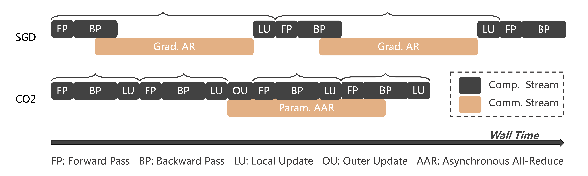

# CO2
CO2: Efficient Distributed Training with Full Communication-Computation Overlap (Paper: https://arxiv.org/abs/2401.16265).

<p align="center">
  
</p>


Please refer to the following repos for trying CO2:
* [fairseq-CO2](https://github.com/weigao266/fairseq-CO2): provides an example for utilizing CO2 within Fairseq framework.
* [fairscale-CO2](https://github.com/weigao266/fairscale-CO2): integrates CO2 within Fairscale framework.


## Citation
If you find our work useful, please cite the following paper:
```
@article{sun2024co2,
  title={CO2: Efficient Distributed Training with Full Communication-Computation Overlap},
  author={Sun, Weigao and Qin, Zhen and Sun, Weixuan and Li, Shidi and Li, Dong and Shen, Xuyang and Qiao, Yu and Zhong, Yiran},
  journal={arXiv preprint arXiv:2401.16265},
  year={2024}
}
```
